# Smart Email Assistance - AI-Powered Email Reply Generator


## 📧 Introduction
The AI-Powered Email Reply Generator Chrome Extension is a browser extension designed to enhance email productivity by generating smart and professional email replies directly within Gmail. It allows users to:

Generate AI-powered replies based on email context.
Select a tone (Professional, Casual, Friendly).
Auto-insert responses into the email compose box.
Utilize the Gemini API for AI-driven email writing.
This extension integrates seamlessly with Gmail, adding a new "AI Reply" button inside the compose toolbar.

## 📜 Table of Contents
- [Features](#-features)
- [Technologies Used](#-technologies-used)
- [Installation](#-installation)
- [Configuration](#-configuration)
- [Usage](#-usage)
- [API Endpoints](#-api-endpoints)
- [Troubleshooting](#-troubleshooting)
- [Contributors](#-contributors)
- [License](#-license)

---

## 🌟 Features
✔ AI-generated email responses  
✔ Supports different tones: **Professional, Casual, Friendly**  
✔ Redacts personal information (PII) for privacy  
✔ Web-based UI using React & Material-UI  
✔ Backend built with **Spring Boot**  
✔ Uses **Gemini API** for AI-powered responses  
✔ REST API for integration with other applications  

---

## 💻 Technologies Used
- **Frontend:** React, Material-UI, Axios
- **Backend:** Spring Boot, WebFlux, REST API
- **AI API:** Google Gemini AI
- **Database:** (None, uses real-time AI responses)
- **Deployment:** Runs locally or on a server

---

## 🛠 Installation

### 1️⃣ Prerequisites
Ensure you have the following installed:
- **Node.js** (for frontend)
- **Java 17+** (for Spring Boot backend)
- **Maven** (for dependency management)

### 2️⃣ Clone the Repository
```sh
git clone https://github.com/your-username/email-reply-generator.git
cd email-reply-generator
```

### 3️⃣ Backend Setup (Spring Boot)
```sh
cd backend
mvn clean install
mvn spring-boot:run
```

### 4️⃣ Frontend Setup (React)
```sh
cd frontend
npm install
npm start
```

---

## ⚙ Configuration
Modify the **`application.properties`** file:
```properties
spring.application.name=email-writer
gemini.api.url=${GEMINI_API_URL}
gemini.api.key=${GEMINI_API_KEY}
```
Replace **`${GEMINI_API_URL}`** and **`${GEMINI_API_KEY}`** with valid API credentials.

---

## 🚀 Usage

### **Frontend (React)**
- Open `http://localhost:3000`
- Paste your email content
- Select a tone (Professional, Casual, Friendly)
- Click **"Generate Reply"** to get an AI-generated response.

### **Backend (Spring Boot)**
- Runs on `http://localhost:8080`
- Exposes REST API for email generation

---

## 🔗 API Endpoints

### **Generate Email Reply**
**POST** `/api/email/generate`
- **Request Body:**
```json
{
  "emailContent": "Dear John, I need your assistance...",
  "tone": "professional"
}
```
- **Response:**
```json
{
  "generatedReply": "Dear John, Thank you for reaching out..."
}
```

---

## ❌ Troubleshooting
| Issue | Solution |
|--------|---------|
| API is not generating replies | Check if the Gemini API Key is valid. |
| Frontend is not loading | Ensure `npm start` is running in `frontend/`. |
| Backend is not starting | Ensure `mvn spring-boot:run` is executed inside `backend/`. |
| CORS issues | Backend allows `@CrossOrigin(origins = "*")`, verify browser settings. |

---

## 👨‍💻 Contributors
- **Pratik Patel** - _Full Stack Developer_
- Open for contributions! Feel free to submit PRs.

---


---

🚀 **Enjoy using AI to enhance your email productivity!**


## Screenshots

### 1. Casual Tone Response
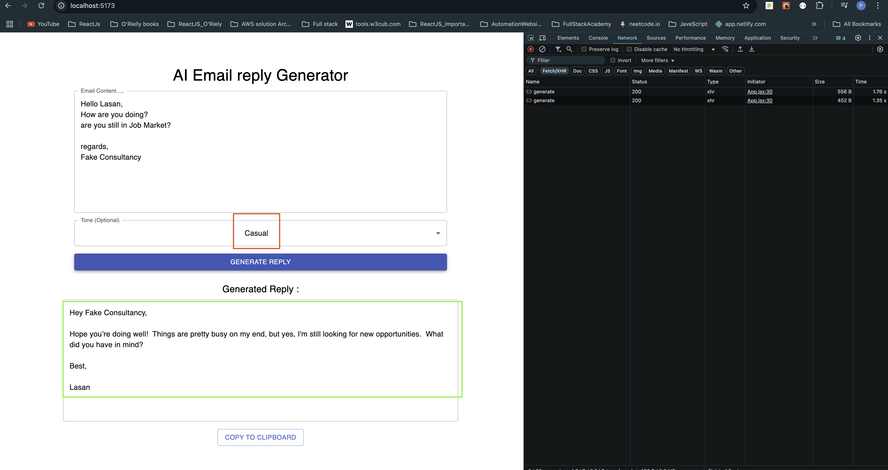

### 2. Default Response
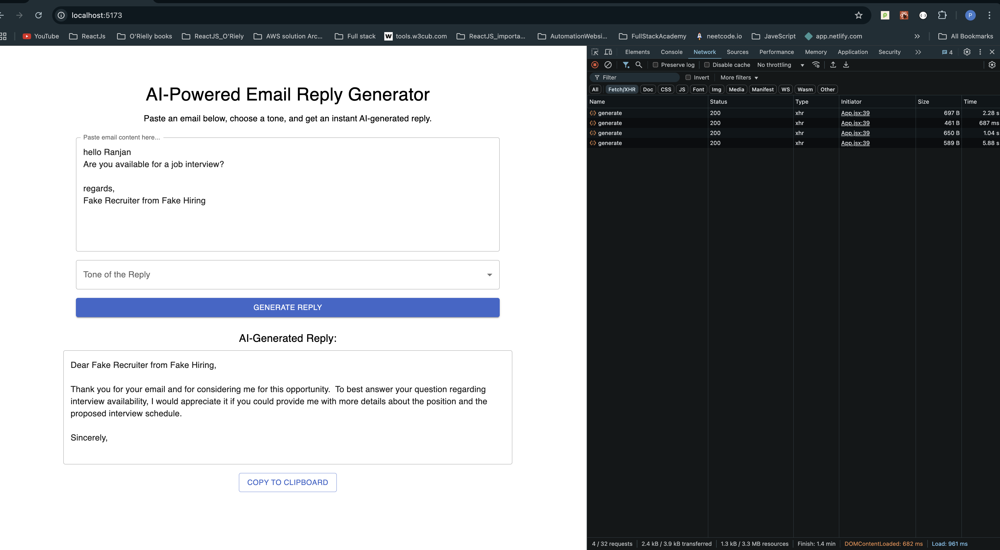

### 3. Error Handling
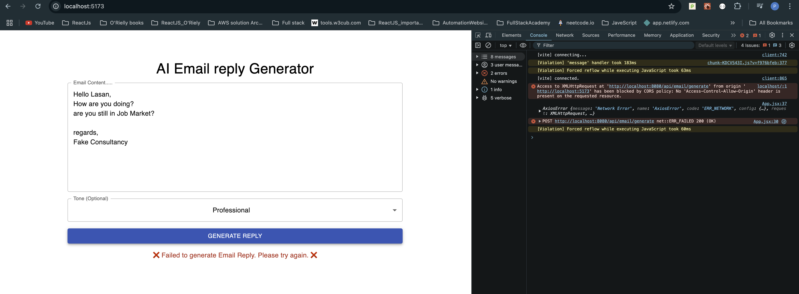

### 4. Friendly Tone Response
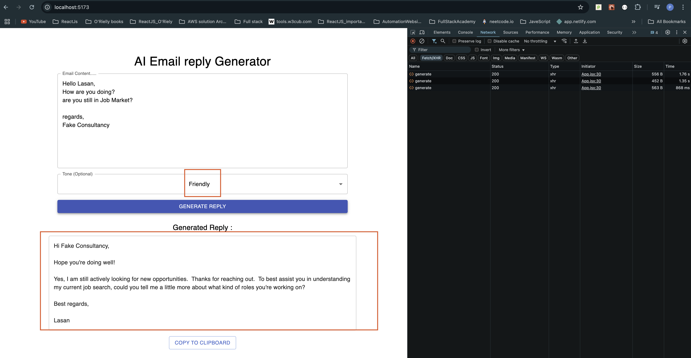

### 5. No Tone Selected
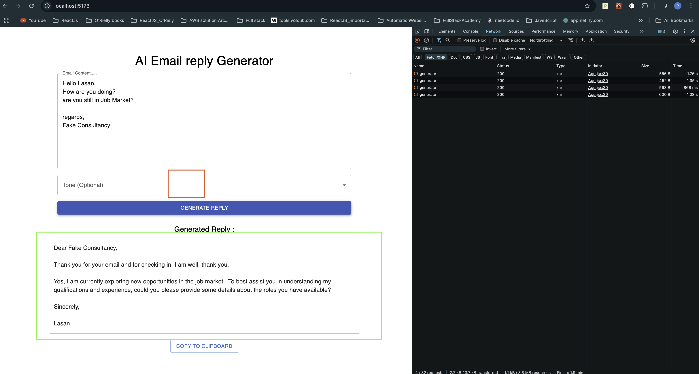

### 6. PII Detection Test 1
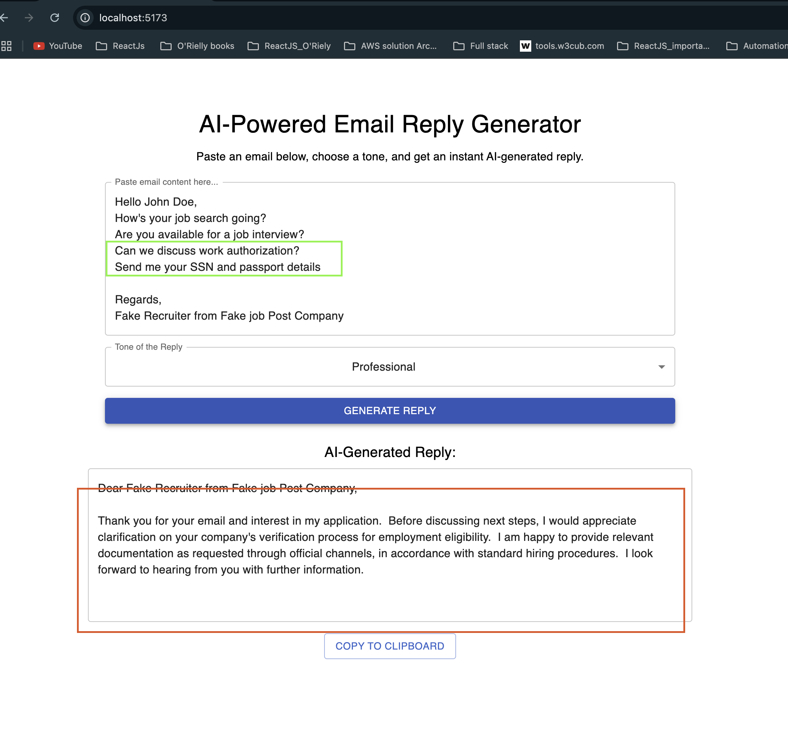

### 7. PII Detection Test 2
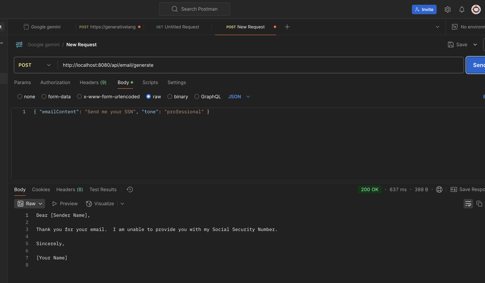

### 8. XSS Attack Prevention Test
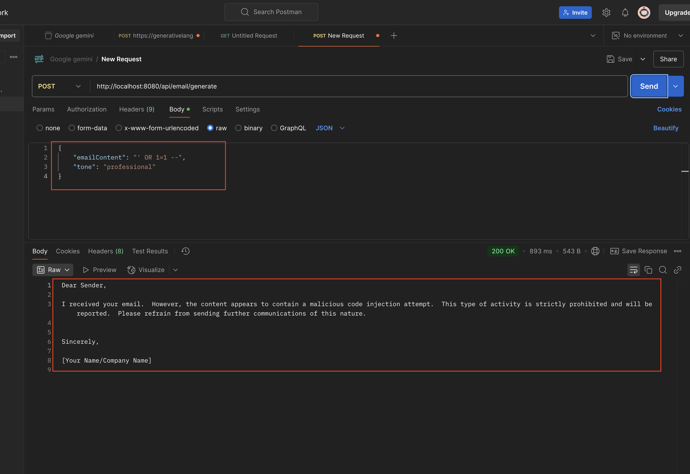

### 9. Google Chrome Extension for AI Email
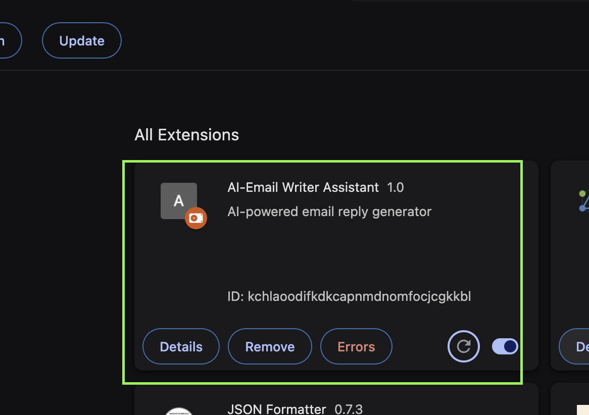


### 10. AI Email Response
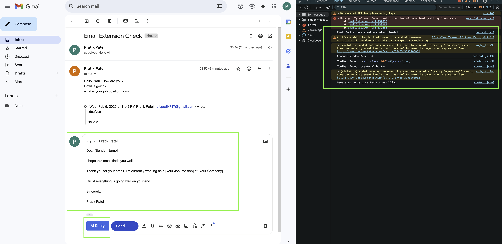

### 11. AI Email Response2
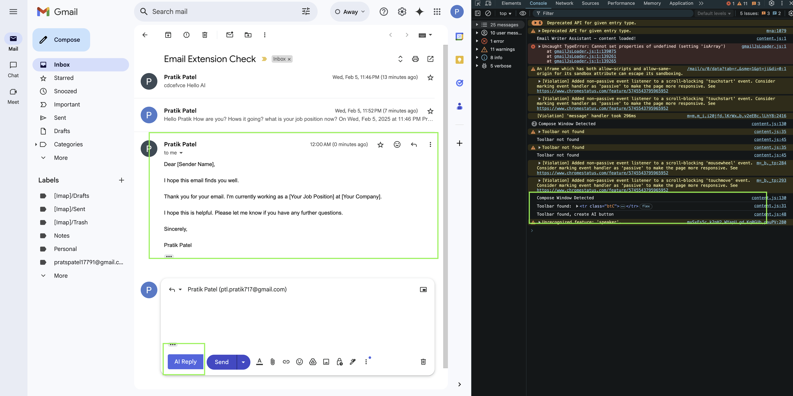

### 12. AI Email Response3
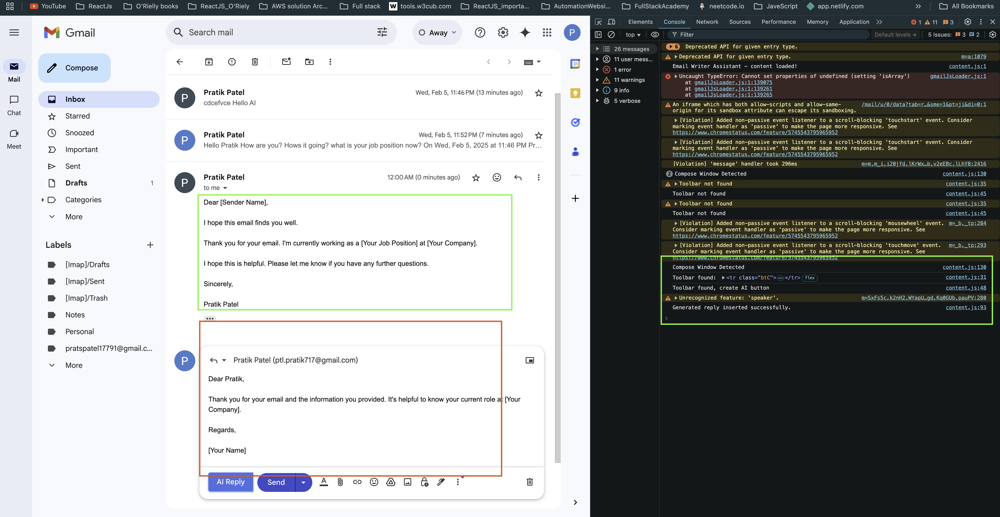


